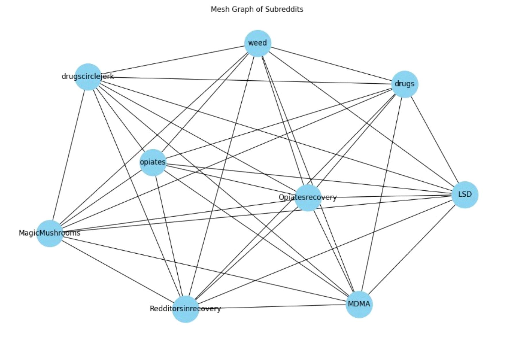
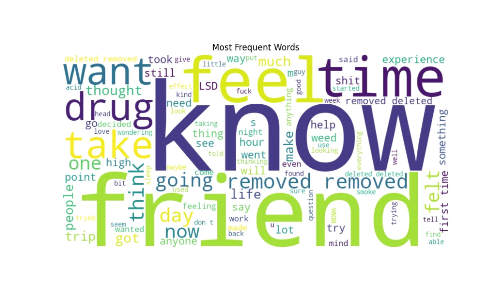
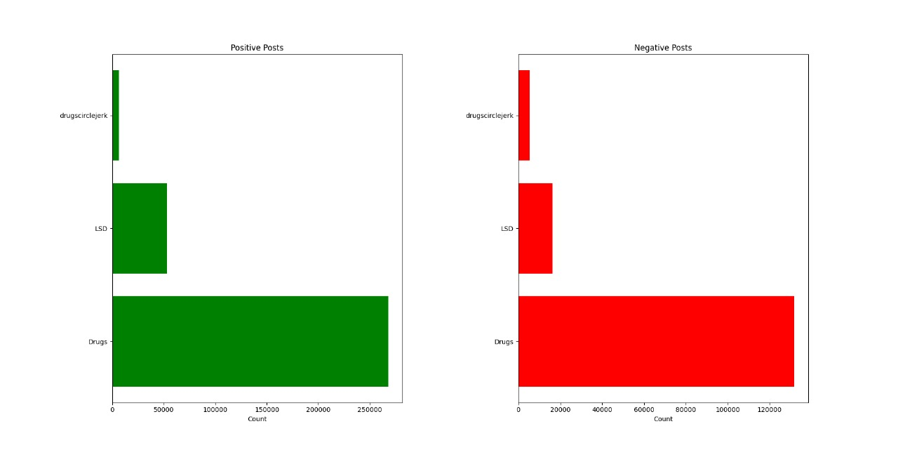

# Analyzing Drug-related Posts and Discussions on Reddit

## We are using these libraries and algorithms
- Sentiment Analysis:
- Trend analysis
- Comparison across Subreddits or Topics:
- Correlation with other variables:
- Correlation between sentiment and post length: 0.15771103420091512 Correlation between 
- Sentiment and number of comments: 0.031565594256087834
- Visualization of the graph of how the number of posts got increased in years and what are they POSITIVE, NEGATIVE or NEUTRAL top subreddit which have a positive and negative post
- Topic Modeling
- Network analysis
- User Number of Posts
- Top active users and Top Engaged users
- Post Type
- Sentiment Analysis
- Time-Series Analysis:
- Top 10 Drugs mention in data
- Most Frequent word
- Post frequency by the user over time
- An active user over time
- User Engagement levels
- Participation Dynamics
- Temporal Patterns
- Peak Activity Periods
- Change in user activity
- Engagement Levels by post type
- Mentions of Opioids/Drugs/Substances over time
- Text Classification
- Trend Analysis on Post Count

### Sentiment Analysis using the Vader sentimentIntensity Analyzer.

In this, we have used the NLTK library to assign sentiment scores to each post and
then classify them based on these scores

i.  POSITIVE
ii. NEGATIVE
iii. NETURAL

### Trend Analysis:
It is used to give reviews of current methods within an organization and
can pinpoint any trend that happened on social media.

### Comparison across subreddits:
We are comparing above mentioned subreddits which have more
engaging audience and which have high posts and how posts are getting
trending.

### Network Analysis:
It involves studing and interpreting
    > relationships between entities such as nodes and interactions that
    > Link them together.

ii\. Time Series analysis:-Time series analysis is a vital statistical
technique used to understand and analyze- data points collected over
successive intervals of time.

iii. Text classification- The process is essential for automating the
org and analyzing large volumes of textual data. Text application in
various fields includes sentiment analysis, spam detection, and topic categorization.

iv. Active Users Over Time:- This process is used in monitoring and
Analyzing the number of active users over time is a crucial aspect of
assessing the health and success of digital platforms, etc.

v. NLP:- The aim of NLP to bridge the gap between human communication
and machines facilitating interactions between humans and computers using
natural language.

-   We are using PYCHARM to run our all program
-   We have created data by ourselves in the format of `.ndJSON`
